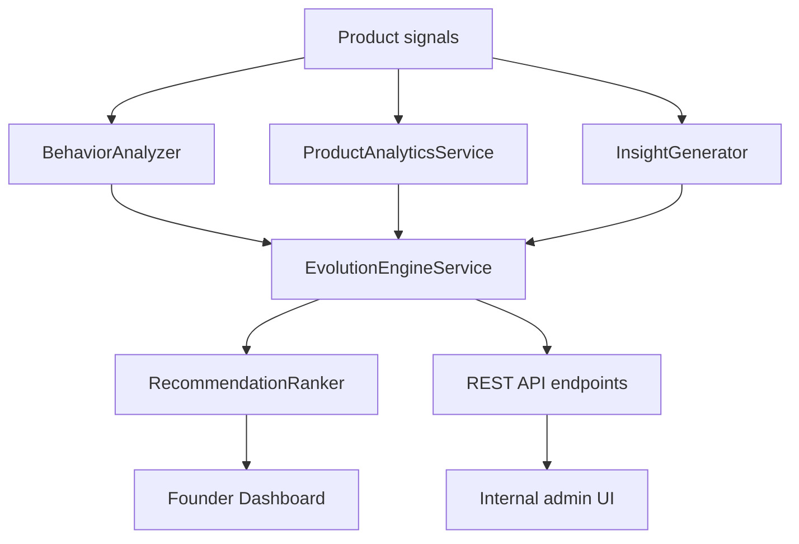

# Synzept V2 Evolution Engine

## Architecture diagram

## Folder structure

- backend/app/api/evolution_engine.py
- backend/app/services/evolution_engine.py
- backend/app/services/evolution_engine_mock_data.py
- backend/tests/test_evolution_engine.py
- frontend/src/app/evolution/page.tsx

## Services

- EvolutionEngineService: orchestrates all modules and returns mock insights and recommendations.
- ProductAnalyticsService: aggregates adoption, activation, and retention-style signals.
- InsightGenerator: turns raw signals into product insights with evidence and confidence.
- RecommendationRanker: ranks actions by estimated impact.
- BehaviorAnalyzer: identifies friction points and behavioral patterns.

## Mock datasets

- Feature usage adoption and engagement values.
- Onboarding completion and drop-off rates.
- Retention and return frequency summaries.
- Example insights and recommendations.

## Founder dashboard

- Product health snapshot.
- Activation funnel summary.
- Retention trends.
- Ranked recommendations.
- Recently detected issues.

## Example insights

- Daily Brief drives activation.
- Workspace setup is the main drop-off.
- Search and chat remain underused.

## Tests

- Backend test covers the main engine endpoints and summary payloads.
